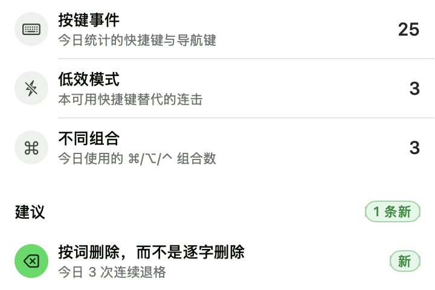
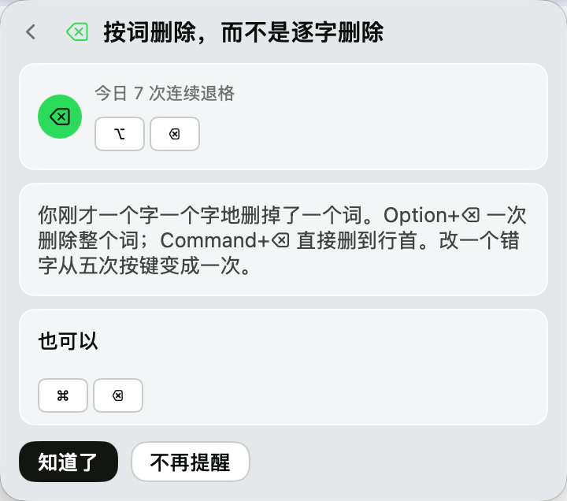
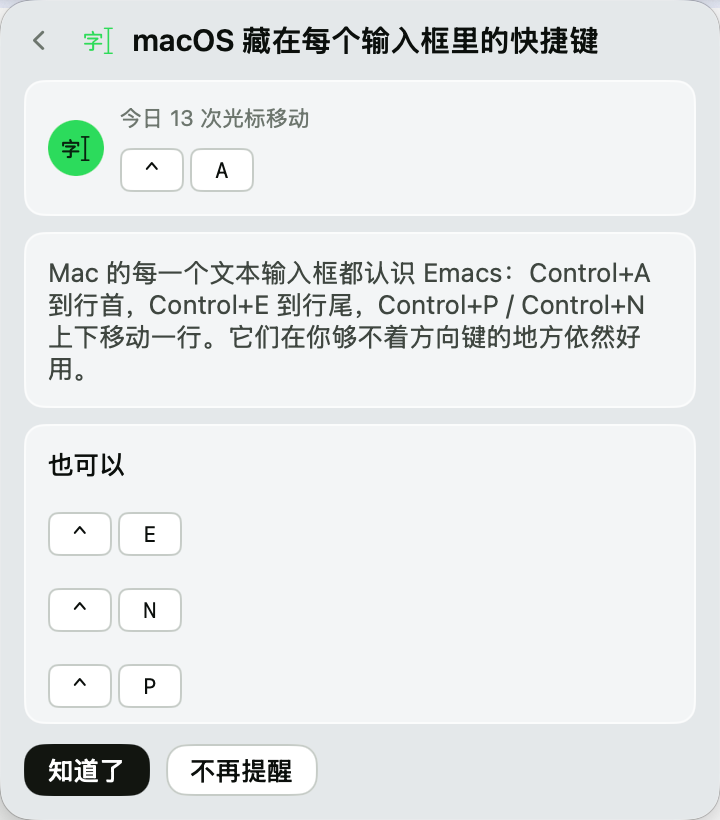
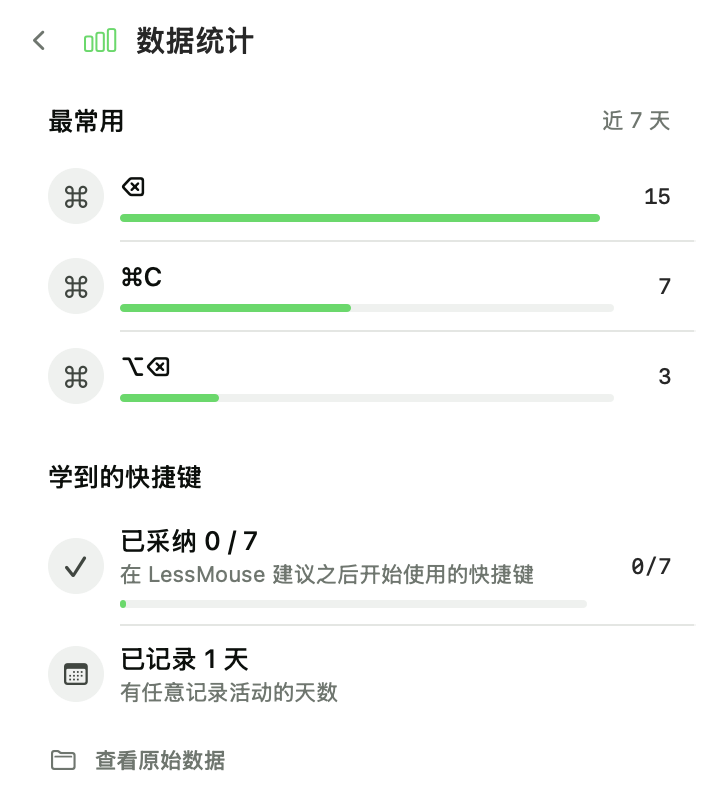
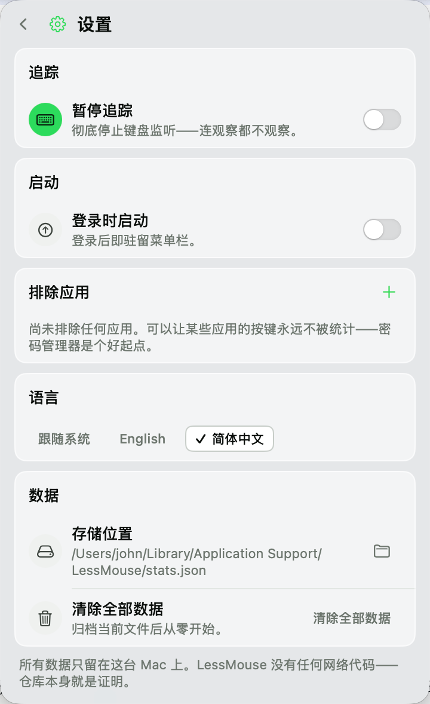

# LessMouse

> 菜单栏上的快捷键教练。它观察你的键盘习惯，发现低效动作——五个退格改一个词、二十个方向键跨一段话——然后告诉你能救它的快捷键。当你开始用它，LessMouse 会发现，并为你庆祝。

**[English README](README.md)**



它来自《AI 时代，你更需要用好快捷键》这篇文章——AI 接管了越来越多的事，剩下那几件还要亲手做的高频操作，更值得做得快。读文章养不成习惯；看见你真实习惯的教练可以。

## 工作原理

1. LessMouse 统计你的按键——**只统计**快捷键和导航键的聚合计数（见下方隐私）。
2. 当某个低效模式一天内重复到阈值（比如三次"连按五个以上退格"），菜单栏 ⌘ 图标出现绿点。
3. 点开：卡片展示它看到了什么、应该按什么（键帽渲染）——而且不止一条路，因为教练不是开处方。
4. 下一次你按下被教的快捷键，卡片翻转为**已采纳**，横幅为你亮一下。进度沉淀在统计页。




## 功能一览

- **今日台账**——按键事件数、检测到的低效模式、使用的不同组合，随打字实时刷新。
- **建议收件箱**——只有当习惯是真实的才出卡片（阈值按"确凿无疑的习惯"而不是"理论上可能"设定）；未读卡片带绿点和"新"徽章。
- **采纳检测**——看过卡片后按下被教的快捷键，庆祝横幅亮一次（每张卡片一生一次）。统计页记录你采纳了多少。
- **数据统计**——近 7 天最常用快捷键排行、采纳进度、观察天数。
- **暂停追踪**——彻底停止键盘监听：连观察都不观察。
- **排除应用**——密码管理器、网银、任何你指定的应用；被排除的应用连看都不看。
- **登录启动**——开机即驻留菜单栏。
- **中文 / English 双语**，跟随系统，也可在设置里手动切换。
- **一键清数据**——两次点击确认；旧数据先归档到磁盘再清空。历史自动保留 60 天。

 

## 隐私——全部政策

**LessMouse 绝不记录你输入的内容。** 事件过滤器只有约 20 行，并有一条遍历"全部键码 × 全部修饰组合"的测试守着这条底线。

被统计的只有三类聚合计数，没有别的：

- **快捷键**——按着 ⌘/⌥/⌃ 的按键（`cmd+c`、`opt+backspace`）
- **导航键**——退格、方向键、Home/End、PageUp/Down、Esc、Tab、F 区
- **低效模式**——"今日退格连击 4 次"这样的模式计数

三重防线：

| 防线 | 作用 |
|---|---|
| 签名过滤器 | 裸字母和 ⇧+字母是文字——在任何记录发生前就被丢弃；按住不放的自动重复永远不计数 |
| 安全输入守卫 | 密码框聚焦期间，LessMouse 什么都观察不到 |
| 应用排除 | 任何应用可整体排除——被排除的应用连观察都不观察 |

所有数据在人类可读的文件里——`~/Library/Application Support/LessMouse/stats.json`——统计页一键打开，设置页一键清除。代码库**零网络代码、零第三方依赖**；欢迎审计，这正是开源的意义。

## 安装

**从源码构建**（全程不需要 Apple 开发者付费账号）：

```bash
git clone https://github.com/AGIHunt/lessmouse.git
cd LessMouse
scripts/make-app.sh     # 构建、组装、ad-hoc 签名 → dist/LessMouse.zip
```

解压后**右键 LessMouse.app → 打开**（首次要点两次）——这是 Gatekeeper 对诚实但未签名软件的标准流程。用得顺手就拖进 `/Applications`。

**首次运行——输入监控。** LessMouse 需要**输入监控**权限（系统设置 → 隐私与安全性 → 输入监控）：统计模式靠的是只读键盘监听（listen-only tap），而 macOS 为它要求的权限就是输入监控——**仅授权"辅助功能"是不够的**。如果授权后仍显示"需要权限"，退出重开一次应用——macOS 会按启动缓存 tap 的拒绝记录。**换了新下载的版本后**（ad-hoc 构建每次身份都会变）：到输入监控列表里先移除旧的 LessMouse 再添加新的。维护者用稳定身份签名（`CODESIGN_IDENTITY=… scripts/make-app.sh`）则无需重新授权。

## 构建与开发

```bash
swift build       # 构建
swift test        # 60 个测试：隐私扫描、检测器、引擎、布局
swift run LessMouse  # 命令行运行（见下注）
```

macOS 14+、Swift 5.9+、零依赖。开发时 `swift run` 可用，但 TCC 会把权限记在你的终端上——要完整体验请用 `scripts/make-app.sh` 产物。

## 教学卡片（v1）

| 你的习惯 | LessMouse 教你 |
|---|---|
| 连着按退格删字 | ⌥⌫ 按词删除 · ⌘⌫ 删到行首 |
| ← → 逐字爬行 | ⌥←/⌥→ 按词跳 · ⌘←/⌘→ 行首行尾 |
| 逐字划选 | ⌥⇧←/→ 按词选择 · ⇧⌘→ 选到行尾 |
| 长距离滚动 | ⌘↑/⌘↓ 文档首尾 |
| 使用 Home/End | ⌘←/⌘→——Mac 的方式 |
| 从不碰 ⌘` | 同应用窗口切换 |
| 只用方向键移动 | ⌃A/⌃E/⌃P/⌃N——每个 Mac 输入框都认识的 Emacs 键 |

已读未采纳的卡片会冷却（3–5 天）再提醒；"不再提醒"则永远消失；采纳只庆祝一次。

## 常见问题

**菜单栏里找不到图标。** 如果你用了菜单栏管理工具（Bartender、Ice、Vanilla……），新图标默认可能被收进隐藏区——在它的设置里把 LessMouse 设为"始终显示"。刘海屏上，菜单栏太满时系统也会把图标折叠进刘海后的隐藏区。LessMouse 自己绝不会撤掉图标。

**我授了"辅助功能"却没反应。** 那是错误的开关——应用需要的是**输入监控**（见"安装"一节）。权限页的按钮会直接打开正确的面板。

**统计里为什么有 `opt+a` 这一条？** 某些键盘布局下 ⌥+字母会直接输入字符（å、∆……）。LessMouse 记的是"组合"（`opt+a: 3`）——聚合计数，不含任何上下文文字。介意的话把对应应用加进排除列表即可。

**数据在哪，怎么彻底删除？** 一个目录：`~/Library/Application Support/LessMouse/`（stats.json + suggestions.json，都是人类可读的）。设置 → "清除全部数据"会先归档再清空。

**感觉哪里卡住了。** 退出重开 LessMouse——事件监听每次启动都会重建。还不行就提个 issue，附上应用版本。

## 贡献

欢迎 PR——包括 **Windows 移植**，架构就是为此设计的（见 [CONTRIBUTING.md](CONTRIBUTING.md)）。

## 许可

MIT——见 [LICENSE](LICENSE)。
